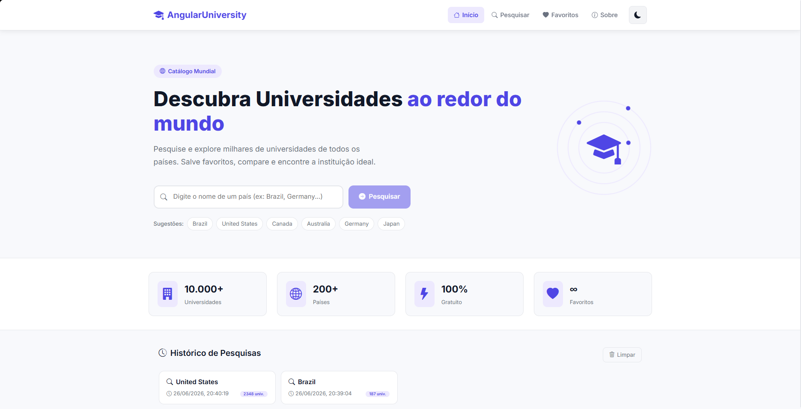
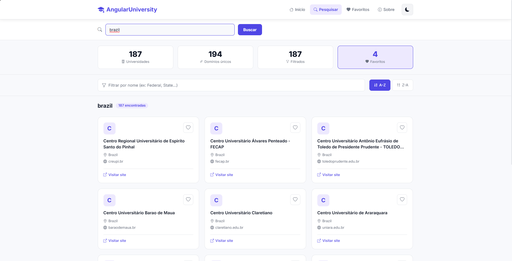
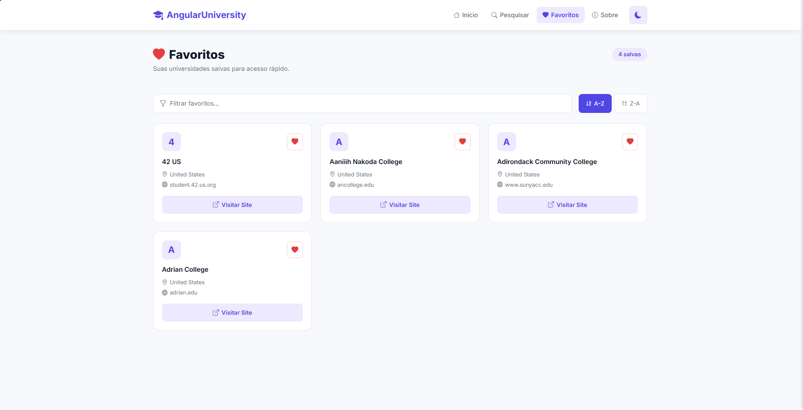

# 🎓 AngularUniversity

> Catálogo mundial de universidades desenvolvido com Angular 17


---

## 📋 Objetivo do Projeto

O **AngularUniversity** é uma aplicação web responsiva que permite pesquisar e explorar universidades de qualquer país do mundo. O sistema consome a [API pública Hipolabs](http://universities.hipolabs.com) e oferece recursos como favoritos, histórico de pesquisas, filtro local, ordenação, paginação e alternância entre Dark Mode e Light Mode.

---

## 🖥️ Telas do Projeto

### Tela Inicial — Pesquisa por País


### Tela de Resultados — Lista de Universidades


### Tela de Favoritos


---

## ⚙️ Tecnologias Utilizadas

| Tecnologia | Versão | Uso |
|---|---|---|
| Angular | 17 | Framework principal |
| TypeScript | 5.x | Linguagem de programação |
| Bootstrap 5 | 5.x | Estilização e responsividade |
| Bootstrap Icons | 1.x | Ícones da interface |
| HttpClient | — | Consumo da API REST |
| Local Storage | — | Persistência de dados |
| SCSS | — | Estilos customizados |

---

## 🚀 Instruções de Instalação

### Pré-requisitos

- [Node.js](https://nodejs.org/) 18+
- [Angular CLI](https://angular.io/cli) 17+

```bash
npm install -g @angular/cli
```

### Instalação

```bash
# 1. Clone o repositório
git clone https://github.com/SEU_USUARIO/AngularUniversity.git

# 2. Acesse a pasta do projeto
cd AngularUniversity

# 3. Instale as dependências
npm install

# 4. Inicie o servidor de desenvolvimento
ng serve

# 5. Acesse no navegador
# http://localhost:4200
```

---

## 🗂️ Estrutura do Sistema

```
src/
├── app/
│   ├── components/
│   │   └── navbar/              # Barra de navegação com toggle de tema
│   ├── pages/
│   │   ├── home/                # Tela inicial com pesquisa e histórico
│   │   ├── results/             # Resultados, filtros, ordenação, paginação
│   │   ├── favorites/           # Universidades salvas no Local Storage
│   │   └── about/               # Informações do projeto
│   ├── services/
│   │   ├── university.service   # Consumo da API REST
│   │   ├── favorites.service    # Gerenciamento de favoritos (LocalStorage)
│   │   ├── history.service      # Histórico de pesquisas (LocalStorage)
│   │   └── theme.service        # Alternância Dark/Light Mode
│   ├── models/
│   │   └── university.interface # Interface TypeScript para University
│   ├── app.routes.ts            # Configuração de rotas
│   └── app.config.ts            # Configuração do HttpClient
└── styles.scss                  # Variáveis de tema global (CSS custom properties)
```

---

## ✅ Funcionalidades Implementadas

- [x] **Pesquisa por país** — campo de texto com sugestões e atalhos rápidos
- [x] **Listagem de universidades** — nome, país, domínio, link para o site
- [x] **Abertura do site oficial** — clique no card abre o site em nova aba
- [x] **Filtro local por nome** — sem nova chamada à API
- [x] **Histórico de pesquisas** — armazenado no LocalStorage com data e contagem
- [x] **Favoritos** — marcar/desmarcar e listar; persistido no LocalStorage
- [x] **Dashboard estatístico** — total, domínios únicos, filtrados, favoritos
- [x] **Ordenação A-Z / Z-A**
- [x] **Interface responsiva** — desktop, tablet e smartphone
- [x] 🌙 **Dark Mode / Light Mode** *(funcionalidade bônus)*
- [x] 📄 **Paginação de resultados** *(funcionalidade bônus)*

---

## 🌐 API Utilizada

**Universities Hipolabs** — gratuita, sem autenticação, retorna JSON.

```
GET http://universities.hipolabs.com/search?country={country}
```

Exemplo: `http://universities.hipolabs.com/search?country=Brazil`

---

## 📄 Licença

Distribuído sob a licença MIT. Veja `LICENSE` para mais detalhes.
